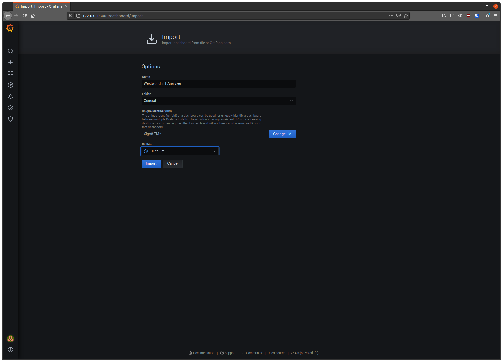
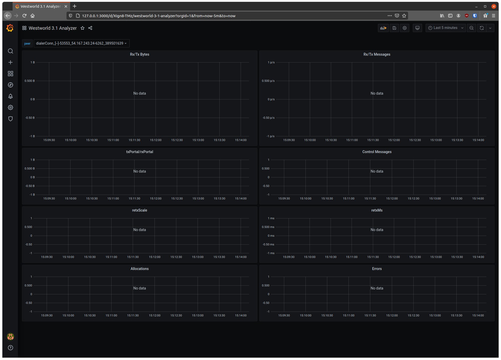
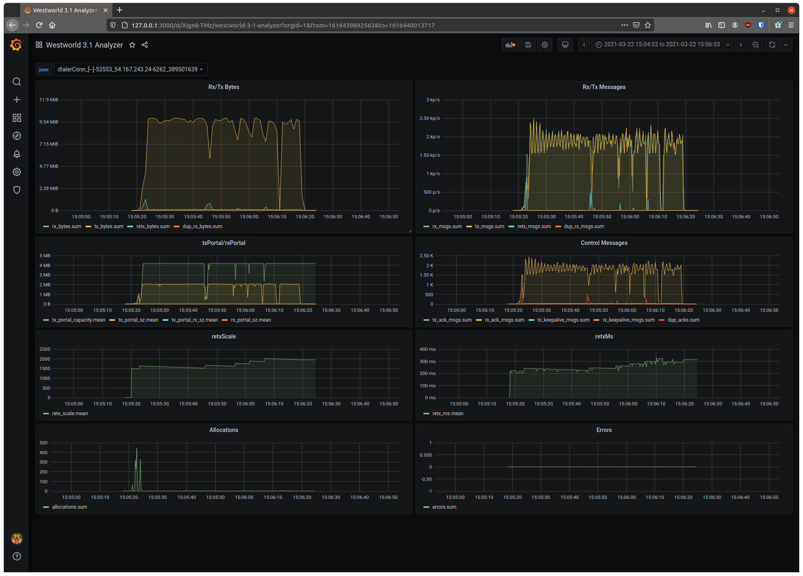
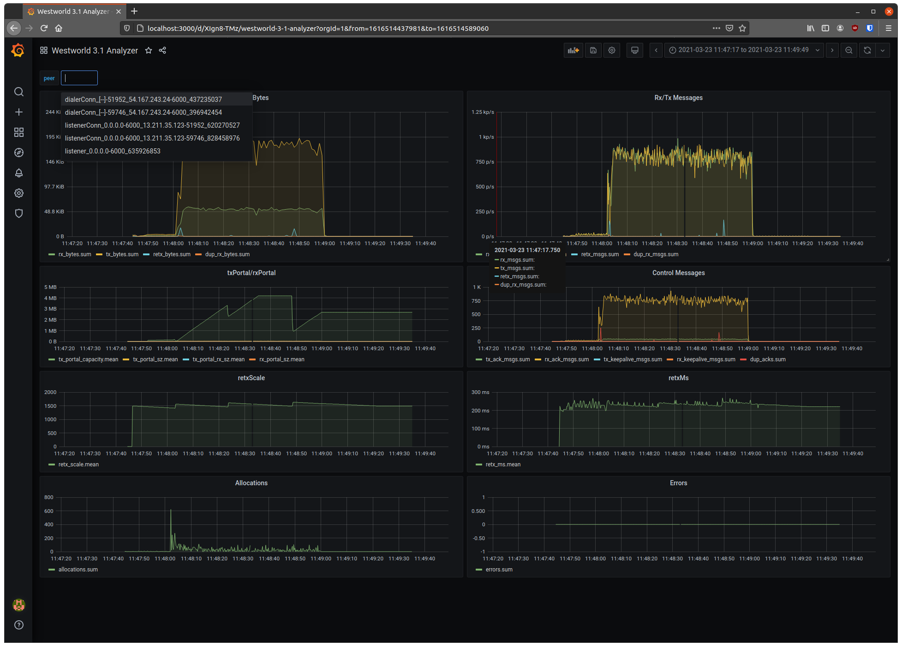

# Transwarp beta_1

_March 23rd, 2021_

# Overview

## Goal: Long-haul, High-performance Data Plane for Ziti

The primary goal of the Transwarp project is to create a long-haul, high-performance data plane for the Ziti fabric. Current production deployments of the Ziti fabric currently rely on TCP connections for the data plane links between routers. As has been previously discussed, TCP is designed with slightly different goals, which results in potentially less-than-optimal performance in a number of important conditions.

TCP is designed to reduce its sending rate when confronted with packet loss in a way that creates "fairness" for multiple connections sharing an underlay link. Transwarp is not primarily concerned with this kind of fairness. In a typical Ziti deployment, Transwarp should be deployed when a network link can be mostly dedicated to the Ziti data plane.

## Configurability, Extensibility, Modern Architecture

Transwarp is designed to be highly configurable and extensible in ways that traditional kernel-space networking stacks are not.

Several of the core algorithms are designed to be "extensible" and tunable in ways that kernel-based stacks are not. Transwarp connections can be differently tuned per-connection. This means that Transwarp supports asymmetrical configuration profiles and can be tuned differently for both the "upstream" and "downstream" sides of a link.

## Head's Up Deployment

Transwarp does not provide a one-size-fits-all profile that works in any deployment situation, like TCP does. Transwarp will need to be intelligently deployed using a reasonable profile selection, so that it provides the appropriate posture to work well in a specific deployment scenario.

Incorrect deployment of Transwarp should not result in non-functioning communication links, but incorrect profile selection could result in under-performance, possibly below the level of TCP.

Future work on the Transwarp stack will continue to evolve the "self-tuning" abilities of Transwarp, making it much more "lights-off".

# Isolated Protocol Testing

The following sections describe a series of scenarios that are known to work to reproduce results like the ones shown during the development of the `transwarp` implementation.

## Host Requirements

The current implementation of the `westworld3` protocol that underpins `transwarp` requires that the host operating system is tuned to support large socket buffer sizes. Development and testing environments include a set of `sysctl` configuration directives:

```
# adjust the socket buffer sizes
net.core.rmem_max = 16777216
net.core.wmem_max = 16777216
net.core.rmem_default = 16777216
net.core.wmem_default = 16777216
net.ipv4.tcp_rmem = 4096 87380 16777216
net.ipv4.tcp_wmem = 4096 65536 16777216
net.ipv4.tcp_mem = 8388608 8388608 16777216
net.ipv4.udp_mem = 8388608 8388608 16777216
```

## Dilithium Tunnel & Dilithium Loop

The `dilithium` project includes tooling for apples-to-apples protocol comparisons through a proxy infrastructure, which operates in the same way as the data plane of the Ziti overlay. The proxy provides an initiating side and a terminating side, with local TCP loops on either side of the protocol under test. The `dilithium tunnel` allows for just the protocol between the terminator and the initiator to be swapped out for other protocols, minimizing variables.

The `dilithium` project also includes tooling for generating consistent loading on both sides of a `dilithium tunnel`. The `dilithium loop` facility is able to saturate a `dilithium tunnel` up to the capacity of a link under test, while (optionally) checking the veracity of the data reception. `dilithium loop` supports both uni-directional and bi-directional testing.

## Profiles

The `westworld3` protocol includes support for _profiles_, which allow the behavior of the protocol to be tuned to match a specific deployment requirement. Here is the default profile that ships with `v0.3.3`:

```
*westworld3.Profile {
	randomize_seq                   false
	connection_setup_timeout_ms     5000
	connection_inactive_timeout_ms  15000
	send_keepalive                  true
	close_wait_ms                   5000
	close_check_ms                  500
	tx_portal_start_sz              98304
	tx_portal_min_sz                16384
	tx_portal_max_sz                4194304
	tx_portal_increase_thresh       224
	tx_portal_increase_scale        1
	tx_portal_dupack_thresh         64
	tx_portal_dupack_capacity_scale 0.9
	tx_portal_dupack_success_scale  0.75
	tx_portal_retx_thresh           64
	tx_portal_retx_capacity_scale   0.75
	tx_portal_retx_success_scale    0.825
	tx_portal_rx_sz_pressure_scale  2.8911
	retx_start_ms                   200
	retx_scale                      1.5
	retx_scale_floor                1
	retx_add_ms                     0
	retx_evaluation_ms              2000
	retx_evaluation_scale_incr      0.15
	retx_evaluation_scale_decr      0.01
	retx_batch_ms                   2
	rtt_probe_ms                    50
	rtt_probe_avg                   8
	rx_portal_sz_pacing_thresh      0.5
	max_segment_sz                  1450
	pool_buffer_sz                  65536
	rx_buffer_sz                    16777216
	tx_buffer_sz                    16777216
	tx_portal_tree_len              16384
	retx_monitor_tree_len           65536
	rx_portal_tree_len              16384
	listener_peers_tree_len         1024
	reads_queue_len                 1024
	listener_rx_queue_len           1024
	accept_queue_len                1024
}
```

These values represent all of the tunable parameters that are exposed from the `westworld3` protocol. These can be provided to the `dilithium tunnel` invocations by providing the path to a YAML file containing override values for the default profile, like this:

```
profile_version: 1

# Cable Upstream Profile
#
tx_portal_max_sz:                   655360
tx_portal_increase_scale:           0.05
tx_portal_dupack_thresh:            192
```

```
$ dilithium tunnel -w cable_upstream.yml
```

## Metrics Instrument

Westworld profiles include support for _instruments_. Instruments allow for development and operational analysis of different parts of the operation of the protocol stack. `westworld3` includes support for a `metrics` instrument. We can enable this instrument with a profile definition like this:

```
profile_version: 1

instrument:
  name:         metrics
  path:         logs
  snapshot_ms:  250
  enabled:      true
```

The `path` value controls the filesystem path where the metrics snapshots will be saved. The `snapshot_ms` value controls how frequently the metrics will be snapshotted.

## Westworld Analyzer

### Run InfluxDB and Grafana with Docker

The `dilithium/bin` folder includes a `run-influxdb.sh` script and a `run-grafana.sh` script. These are configured to launch an InfluxDB and Grafana instance to use with the Westworld Analyzer. Adjust the mount path in the `run-influxdb.sh` script if you want your persistent storage to go to a different folder.

Once you have the InfluxDB container running, you'll want a local `influx` client to access the database. With that installed, you'll need to create a `dilithium` database instance to contain metrics from `westworld3`.

```
$ influx
> create database dilithium
```

With the Grafana container running, connect to it through a web browser on port `3000`. The default username and password are `admin`/`admin`. With Grafana running, you'll need to add an InfluxDB datasource:


You'll want to update the name to `Dilithium`, the URL to `http://127.0.0.1:8086`, and the database to `dilithium`. "Save & Test" should return a successful result.

Once you've got the datasource configured, you'll need to import the Westworld3.1 Analyzer dashboard, which is found in the `dilithium/grafana` folder:



Make sure you've selected the `Dilithium` datasource for the dashboard as defined in the previous step.

### Run Scenario, Snapshot Metrics

With the metrics instrument enabled in your `westworld3` profile, the `dilithium tunnel` command should produce a log line like this:

```
[   0.001]    INFO dilithium/util.(*CtrlListener).run: [logs/westworld3.13389.sock] started
```

The `logs/westworld3.13389.sock` is a unix domain socket that can be used to control the metrics instrumentation with the `dilithium ctrl` commands. Use the `dilithium ctrl client` command to snapshot the metrics:

```
$ dilithium ctrl client logs/westworld3.13389.sock
[   0.049]    INFO dilithium/cmd/dilithium/ctrl.client: received 'ok'
[   0.049]    INFO main.main: finished
```

The above command will cause the onboard metrics instrument to write all observed snapshots out to a series of files, representing the metrics collected by the instrument:

```
[fedora@ip-10-0-0-217 ~]$ find logs/listener_0.0.0.0-6262_806204675/
logs/listener_0.0.0.0-6262_806204675/
logs/listener_0.0.0.0-6262_806204675/rx_keepalive_bytes.csv
logs/listener_0.0.0.0-6262_806204675/tx_portal_sz.csv
logs/listener_0.0.0.0-6262_806204675/metrics.id
logs/listener_0.0.0.0-6262_806204675/rx_keepalive_msgs.csv
logs/listener_0.0.0.0-6262_806204675/rx_ack_bytes.csv
logs/listener_0.0.0.0-6262_806204675/tx_keepalive_msgs.csv
logs/listener_0.0.0.0-6262_806204675/dup_rx_msgs.csv
logs/listener_0.0.0.0-6262_806204675/dup_acks.csv
logs/listener_0.0.0.0-6262_806204675/rx_ack_msgs.csv
logs/listener_0.0.0.0-6262_806204675/tx_portal_rx_sz.csv
logs/listener_0.0.0.0-6262_806204675/rx_msgs.csv
logs/listener_0.0.0.0-6262_806204675/retx_scale.csv
logs/listener_0.0.0.0-6262_806204675/tx_bytes.csv
logs/listener_0.0.0.0-6262_806204675/tx_ack_msgs.csv
logs/listener_0.0.0.0-6262_806204675/rx_bytes.csv
logs/listener_0.0.0.0-6262_806204675/allocations.csv
logs/listener_0.0.0.0-6262_806204675/retx_ms.csv
logs/listener_0.0.0.0-6262_806204675/tx_portal_capacity.csv
logs/listener_0.0.0.0-6262_806204675/errors.csv
logs/listener_0.0.0.0-6262_806204675/dup_rx_bytes.csv
logs/listener_0.0.0.0-6262_806204675/rx_portal_sz.csv
logs/listener_0.0.0.0-6262_806204675/tx_keepalive_bytes.csv
logs/listener_0.0.0.0-6262_806204675/retx_bytes.csv
logs/listener_0.0.0.0-6262_806204675/retx_msgs.csv
logs/listener_0.0.0.0-6262_806204675/tx_msgs.csv
logs/listener_0.0.0.0-6262_806204675/tx_ack_bytes.csv
```

You'll want to collect these files for processing by the Westworld Analyzer.

### Import Metrics

The `dilithium influx` commands are used to load the metrics data produced by the metrics instrument into the Westworld Analyzer. With the above metrics data collected, it can be imported into the Westworld Analyzer with the `dilithium influx load` command, like this:

```
$ dilithium influx load /home/michael/.fablab/instances/transwarp/forensics/1616435348256
[   0.001]    INFO dilithium/cmd/dilithium/influx.loadWestworld31Metrics: wrote [265] points for westworld3.1 peer [listenerConn_0.0.0.0-6262_13.211.35.123-60243_412359814] dataset [tx_bytes]
[   0.002]    INFO dilithium/cmd/dilithium/influx.loadWestworld31Metrics: wrote [265] points for westworld3.1 peer [listenerConn_0.0.0.0-6262_13.211.35.123-60243_412359814] dataset [tx_msgs]
[   0.002]    INFO dilithium/cmd/dilithium/influx.loadWestworld31Metrics: wrote [265] points for westworld3.1 peer [listenerConn_0.0.0.0-6262_13.211.35.123-60243_412359814] dataset [retx_bytes]
[   0.003]    INFO dilithium/cmd/dilithium/influx.loadWestworld31Metrics: wrote [265] points for westworld3.1 peer [listenerConn_0.0.0.0-6262_13.211.35.123-60243_412359814] dataset [retx_msgs]
[   0.005]    INFO dilithium/cmd/dilithium/influx.loadWestworld31Metrics: wrote [265] points for 
...
[   0.124]    INFO dilithium/cmd/dilithium/influx.loadWestworld31Metrics: wrote [266] points for westworld3.1 peer [dialerConn_[--]-60243_54.167.243.24-6262_623195017] dataset [dup_rx_msgs]
[   0.125]    INFO dilithium/cmd/dilithium/influx.loadWestworld31Metrics: wrote [266] points for westworld3.1 peer [dialerConn_[--]-60243_54.167.243.24-6262_623195017] dataset [allocations]
[   0.125]    INFO dilithium/cmd/dilithium/influx.loadWestworld31Metrics: wrote [266] points for westworld3.1 peer [dialerConn_[--]-60243_54.167.243.24-6262_623195017] dataset [errors]
[   0.142]    INFO main.main: finished
```

### Analzye

With the dataset loaded into the Westworld Analyzer, it can be explored using the _Westworld3.1 Analyzer_ dashboard you previously imported. You'll want to use the time range controls to find your run telemetry and zoom in on relevant portions of the dataset:


Notice the "peer" dropdown in the upper left corner of the dashboard. This will allow you to select the metrics from the peer components present in the dataset. Typically there are separate metrics from the `dialerConn` and `listenerConn` connections, and also a separate set of metrics from the active `listener` that is persistently available in the `westworld3` application.

### Clean Metrics

The `dilithium influx clean` command will remove all metrics snapshots from your analyzer InfluxDB database. Because differentiating multiple peers and time ranges can get cumbersome, it's often best to run `dilithium influx clean` to start with a clean slate, and then load in an appropriate dataset for investigation. It's easiest to keep the datasets on disk as files, and only load them into the analyzer for analysis.

## Complete Dilithium Example

The following illustrates a complete example using `dilithium tunnel` and `fablab` (outside of scope for this document) to execute a test and analyze the performance.

### Scenario

In the testing scenario there are two Linux hosts each in a VPC in a different AWS region, separated by significant geography. We're going to compare the performance of `westworld3` and `tcp` over the `dilithium tunnel`.

To keep things simple, we're going to run a file transfer over the tunnel using `scp`, but any TCP-based application protocol should work just fine.

### Launch Tunnel Server and Client

First, we'll need to launch the `dilithium tunnel server` and the `dilithium tunnel client`:

```
$ fablab/bin/dilithium tunnel server 0.0.0.0:6262 127.0.0.1:22 -w fablab/cfg/dilithium/westworld3.1/development.yml 
[   0.000]    INFO dilithium/protocol/westworld3.NewMetricsInstrument: config {
	path        logs
	snapshot_ms 250
	enabled     true
}

[   0.001]    INFO dilithium/cmd/dilithium/tunnel.tunnelServer: created tunnel listener at [0.0.0.0:6262]
[   0.001]    INFO dilithium/protocol/westworld3.(*listener).run: started
[   0.001]    INFO dilithium/util.(*CtrlListener).run: [logs/westworld3.13877.sock] started
[   0.001]    INFO dilithium/protocol/westworld3.(*metricsInstrumentInstance).snapshotter: started
```

Use `dilithium tunnel server --help` for details. `0.0.0.0:6262` is the address that the server will listen on for incoming connections for the protocol under test. `127.0.0.1:22` is the "service address" where the tunneled connection will terminate (an `ssh` endpoint on port `22` in our case).

```
[fedora@ip-10-0-0-222 ~]$ fablab/bin/dilithium tunnel client 54.167.243.24:6262 127.0.0.1:1122 -w fablab/cfg/dilithium/westworld3.1/development.yml 
[   0.001]    INFO dilithium/cmd/dilithium/tunnel.tunnelClient: created initiator listener at [127.0.0.1:1122]
```

Use `dilithium tunnel client --help` for details. `54.167.243.24:6262` corresponds to the public address of the `server` we created above. `127.0.0.1:1122` is the local listening address where connections to be tunneled will be accepted.

So in the above example, we'll point our `scp` client at `127.0.0.1:1122` on the host running the `dilithium tunnel client`, and that connection will be proxied across the `westworld3` connection between the `server` and the `client`, and will be terminated at `127.0.0.1:22` on the host running the server.

### Run Workload

The scenario workload is executed from the host running the `dilithium tunnel client`:

```
[fedora@ip-10-0-0-222 ~]$ scp -P 1122 junk 127.0.0.1:
junk                                                                                                                         100%  511MB   9.1MB/s   00:56
```

### Collect Metrics

Snapshot `server` metrics:

```
fedora@ip-10-0-0-217 ~]$ fablab/bin/dilithium ctrl client logs/westworld3.13877.sock 
[   0.104]    INFO dilithium/cmd/dilithium/ctrl.client: received 'ok'
[   0.104]    INFO main.main: finished
```

Snapshot `client` metrics:

```
[fedora@ip-10-0-0-222 ~]$ fablab/bin/dilithium ctrl client logs/westworld3.25891.sock 
[   0.017]    INFO dilithium/cmd/dilithium/ctrl.client: received 'ok'
[   0.017]    INFO main.main: finished
```

Retrieve metrics data from both hosts using whatever mechanism makes the most sense for your environment. In this example, I'm using fablab:

```
$ fablab exec logs
[   0.000]    INFO fablab/zitilib/actions.(*logs).forHost: => [/home/michael/.fablab/instances/transwarp/forensics/1616440013148/logs/local/local]
[   3.452]    INFO fablab/kernel/fablib.RetrieveRemoteFiles: logs/listenerConn_0.0.0.0-6262_13.211.35.123-53553_388949287/rx_keepalive_bytes.csv => 5.9 kB
[   3.718]    INFO fablab/kernel/fablib.RetrieveRemoteFiles: logs/listenerConn_0.0.0.0-6262_13.211.35.123-53553_388949287/tx_portal_sz.csv => 6.3 kB
[   3.996]    INFO fablab/kernel/fablib.RetrieveRemoteFiles: logs/listenerConn_0.0.0.0-6262_13.211.35.123-53553_388949287/metrics.id => 26 B
...
[  14.628]    INFO fablab/kernel/fablib.RetrieveRemoteFiles: logs/listener_0.0.0.0-6262_142707432/metrics.id => 26 B
[  14.938]    INFO fablab/kernel/fablib.RetrieveRemoteFiles: logs/listener_0.0.0.0-6262_142707432/rx_keepalive_msgs.csv => 7.7 kB
[  15.211]    INFO fablab/kernel/fablib.RetrieveRemoteFiles: logs/listener_0.0.0.0-6262_142707432/rx_ack_bytes.csv => 7.7 kB
[  15.507]    INFO fablab/kernel/fablib.RetrieveRemoteFiles: logs/listener_0.0.0.0-6262_142707432/tx_keepalive_msgs.csv => 7.7 kB
...
[  23.288]    INFO fablab/zitilib/actions.(*logs).forHost: => [/home/michael/.fablab/instances/transwarp/forensics/1616440013148/logs/remote/remote]
[  51.316]    INFO fablab/kernel/fablib.RetrieveRemoteFiles: logs/dialerConn_[--]-53553_54.167.243.24-6262_389501639/rx_keepalive_bytes.csv => 5.9 kB
[  53.770]    INFO fablab/kernel/fablib.RetrieveRemoteFiles: logs/dialerConn_[--]-53553_54.167.243.24-6262_389501639/tx_portal_sz.csv => 7.3 kB
[  56.217]    INFO fablab/kernel/fablib.RetrieveRemoteFiles: logs/dialerConn_[--]-53553_54.167.243.24-6262_389501639/metrics.id => 26 B
...
```

We've pulled down peer data for `listenerConn_0.0.0.0-6262_13.211.35.123-53553_388949287`, `listener_0.0.0.0-6262_142707432`, and `dialerConn_[--]-53553_54.167.243.24-6262_389501639`, and those trees of files are located at `/home/michael/.fablab/instances/transwarp/forensics/1616440013148/logs`.

Next, we'll make sure the analyzer is cleaned of previous analysis data:

```
$ dilithium influx clean
[   0.003]    INFO dilithium/cmd/dilithium/influx.influxClean: dropped series [dup_acks]
[   0.004]    INFO dilithium/cmd/dilithium/influx.influxClean: dropped series [errors]
[   0.005]    INFO dilithium/cmd/dilithium/influx.influxClean: dropped series [retx_scale]
...
[   0.075]    INFO dilithium/cmd/dilithium/influx.influxClean: dropped series [dup_rx_bytes]
[   0.075]    INFO dilithium/cmd/dilithium/influx.influxClean: dropped series [rx_portal_sz]
[   0.076]    INFO dilithium/cmd/dilithium/influx.influxClean: dropped series [tx_portal_rx_sz]
[   0.076]    INFO main.main: finished
```

And then we'll import the new dataset:

```
$ dilithium influx load /home/michael/.fablab/instances/transwarp/forensics/1616440013148/logs
[   0.001]    INFO dilithium/cmd/dilithium/influx.loadWestworld31Metrics: wrote [352] points for westworld3.1 peer [listener_0.0.0.0-6262_142707432] dataset [tx_bytes]
[   0.002]    INFO dilithium/cmd/dilithium/influx.loadWestworld31Metrics: wrote [352] points for westworld3.1 peer [listener_0.0.0.0-6262_142707432] dataset [tx_msgs]
...
[   0.091]    INFO dilithium/cmd/dilithium/influx.loadWestworld31Metrics: wrote [267] points for westworld3.1 peer [listenerConn_0.0.0.0-6262_13.211.35.123-53553_388949287] dataset [dup_rx_msgs]
[   0.091]    INFO dilithium/cmd/dilithium/influx.loadWestworld31Metrics: wrote [267] points for westworld3.1 peer [listenerConn_0.0.0.0-6262_13.211.35.123-53553_388949287] dataset [allocations]
[   0.092]    INFO dilithium/cmd/dilithium/influx.loadWestworld31Metrics: wrote [267] points for westworld3.1 peer [listenerConn_0.0.0.0-6262_13.211.35.123-53553_388949287] dataset [errors]
[   0.111]    INFO main.main: finished
```

If we load up the Westworld 3.1 Analyzer in Grafana, we should see something like this:



By default the dashboard shows the last 5 minutes, so we'll want to zoom out to the last 30 minutes (or whatever is necessary for your dataset):


From there, you can zoom in on the dataset in detail:



### Comparing Against TCP

We can run the scenerio again, swapping in the `tcp` protocol instead of the `westworld3` protocol by invoking the `dilithium tunnel server` and `client` like this:

```
[fedora@ip-10-0-0-217 ~]$ fablab/bin/dilithium tunnel server 0.0.0.0:6262 127.0.0.1:22 -p tcp
```

```
[fedora@ip-10-0-0-222 ~]$ fablab/bin/dilithium tunnel client 54.167.243.24:6262 127.0.0.1:1122 -p tcp

```

The `-p <protocol>` option allows for specifying a different underlay protocol to be used when proxying.

# Enabling Transwarp in Ziti

Transwarp is the utilization of the `westworld3` protocol for data plane communications within the Ziti overlay.

## Transwarp vs TranswarpTLS

Ziti now has support for the `transwarp:` and `transwarptls:` transports. These `transwarp:` is analagous to `tcp:` and `transwarptls:` is conceptually similar to `tls:`. `transwarptls:` wraps the `westworld3` protocol in a TLS wrapper, providing the same privacy and authentication mechanisms as `tls:`.

## Link Listener

To enable Transwarp in the Ziti fabric data plane, simply adjust any link listeners (in target router configurations) to use the `transwarp:` or `transwarptls:` protocols:

```
link:
  listeners:
    - binding:          transport
      bind:             transwarptls:127.0.0.1:6002
      advertise:        transwarptls:127.0.0.1:6002
```

## Profile Specification

The underlying `westworld3` protocol profile can be specified in the Ziti router configuration like this:

```
transport:
  westworld3:
    profile_version:              1
    tx_portal_min_sz:             16384
    tx_portal_max_sz:             1073741824
    instrument:
      name:                       metrics
      path:                       /tmp/westworld3
      snapshot_ms:                250
      enabled:                    true
```

This allows for configuring the `westworld3` profile values as described above in the `dilithium`-only example.

## Debugging Transwarp in Ziti

The metrics instrument (and the other `dilithium` instruments) can be used with the downstream Westworld 3.1 Analyzer in the same way as the `dilithium`-only example. Enable the metrics instrument in the router's profile, and then use the `dilithium ctrl client` tool to snapshot the instrument, producing the dataset for the analyzer.

# A Complete Ziti Example

This example will be configured similarly to the pure `dilithium` example above. There are two routers, each in an AWS VPC in different regions separated by geography. One of the routers provides a link listener, configured to use `transwarptls:`.

Here's the relevant logging output from the `ziti-router` process:

```
[   0.002]    INFO foundation/transport/transwarptls.Listen: westworld3 profile = [
*westworld3.Profile {
	randomize_seq                   false
	connection_setup_timeout_ms     5000
	connection_inactive_timeout_ms  15000
	send_keepalive                  true
	close_wait_ms                   5000
	close_check_ms                  500
	tx_portal_start_sz              98304
	tx_portal_min_sz                16384
	tx_portal_max_sz                4194304
	tx_portal_increase_thresh       224
	tx_portal_increase_scale        1
	tx_portal_dupack_thresh         64
	tx_portal_dupack_capacity_scale 0.9
	tx_portal_dupack_success_scale  0.75
	tx_portal_retx_thresh           64
	tx_portal_retx_capacity_scale   0.75
	tx_portal_retx_success_scale    0.825
	tx_portal_rx_sz_pressure_scale  2.8911
	retx_start_ms                   200
	retx_scale                      1.5
	retx_scale_floor                1
	retx_add_ms                     0
	retx_evaluation_ms              2000
	retx_evaluation_scale_incr      0.15
	retx_evaluation_scale_decr      0.01
	retx_batch_ms                   2
	rtt_probe_ms                    50
	rtt_probe_avg                   8
	rx_portal_sz_pacing_thresh      0.5
	max_segment_sz                  1450
	pool_buffer_sz                  65536
	rx_buffer_sz                    16777216
	tx_buffer_sz                    16777216
	tx_portal_tree_len              16384
	retx_monitor_tree_len           65536
	rx_portal_tree_len              16384
	listener_peers_tree_len         1024
	reads_queue_len                 1024
	listener_rx_queue_len           1024
	accept_queue_len                1024
}

]
[   0.002]    INFO fabric/router.(*Router).startXlinkListeners: started Xlink listener with binding [transport] advertising [transwarptls:54.167.243.24:6000]
```

Here's the relevant log output when starting the second `ziti-router`, configured without a link listener. This output represents it dialing the `transwarptls:` link connection to the first router:

```
[   0.630]    INFO fabric/router/handler_ctrl.(*dialHandler).handle: received link connect request
[   0.630]    INFO fabric/router/xlink_transport.(*dialer).Dial: dialing link with split payload/ack channels [l/ZoLq]
[   0.631]    INFO fabric/router/xlink_transport.(*dialer).Dial: dialing payload channel for link [l/ZoLq]
[   0.631]    INFO foundation/transport/transwarptls.Dial: westworld3 profile = [
*westworld3.Profile {
	...
}

]
[   0.631]    INFO dilithium/protocol/westworld3.(*dialerConn).hello: starting hello process
[   0.631]    INFO dilithium/protocol/westworld3.(*rxPortal).run: started
[   0.830]    INFO dilithium/protocol/westworld3.(*dialerConn).hello: completed hello process
[   0.830]    INFO dilithium/protocol/westworld3.(*dialerConn).rxer: started
[   0.831]    INFO dilithium/protocol/westworld3.(*txPortal).keepaliveSender: started
[   0.831]    INFO dilithium/protocol/westworld3.(*closer).run: started
[   0.831]    INFO dilithium/protocol/westworld3.(*retxMonitor).run: started
[   1.264]    INFO fabric/router/xlink_transport.(*dialer).Dial: dialing ack channel for link [l/ZoLq]
[   1.264]    INFO foundation/transport/transwarptls.Dial: westworld3 profile = [
*westworld3.Profile {
	...
}

]
[   1.265]    INFO dilithium/protocol/westworld3.(*dialerConn).hello: starting hello process
[   1.265]    INFO dilithium/protocol/westworld3.(*rxPortal).run: started
[   1.464]    INFO dilithium/protocol/westworld3.(*dialerConn).hello: completed hello process
[   1.464]    INFO dilithium/protocol/westworld3.(*dialerConn).rxer: started
[   1.464]    INFO dilithium/protocol/westworld3.(*txPortal).keepaliveSender: started
[   1.464]    INFO dilithium/protocol/westworld3.(*closer).run: started
[   1.464]    INFO dilithium/protocol/westworld3.(*retxMonitor).run: started
[   1.896]    INFO fabric/router.(*xlinkAccepter).Accept: accepted new link [l/ZoLq]
[   1.896]    INFO fabric/router/handler_ctrl.(*dialHandler).handle: link [l/ZoLq] established
```

Ziti links currently require 2 underlay connections, with one of them dedicated to flow control processing. This is why there are 2 `westworld3` connections established above.

After running our workload over the Ziti fabric with a Transwarp data plane, we can retrieve the `westworld3` analysis dataset in the same way we did in the plain `dilithium` scenario above. Both routers emit log messages advertising their metrics instrument control socket:

```
[   0.003]    INFO dilithium/util.(*CtrlListener).run: [logs/westworld3.17856.sock] started
```

```
[   0.637]    INFO dilithium/util.(*CtrlListener).run: [logs/westworld3.30033.sock] started
```

We can use those sockets to snapshot the metrics:

```
[fedora@ip-10-0-0-217 ~]$ fablab/bin/dilithium ctrl client logs/westworld3.17856.sock 
[   0.070]    INFO dilithium/cmd/dilithium/ctrl.client: received 'ok'
[   0.071]    INFO main.main: finished
```

```
[fedora@ip-10-0-0-222 ~]$ fablab/bin/dilithium ctrl client logs/westworld3.30033.sock 
[   0.053]    INFO dilithium/cmd/dilithium/ctrl.client: received 'ok'
[   0.053]    INFO main.main: finished
```

When we retrieve the analysis dataset from the routers, we can ingest them into the Westworld 3.1 Analyzer using the approach described above.



When loading the dataset into the analyzer, you'll see that there is 1 `listener` peer, and 2 each of `listenerConn` and `dialerConn` for the above scenario. In situations where more links are being used, there will potentially be more peers and a larger dataset.